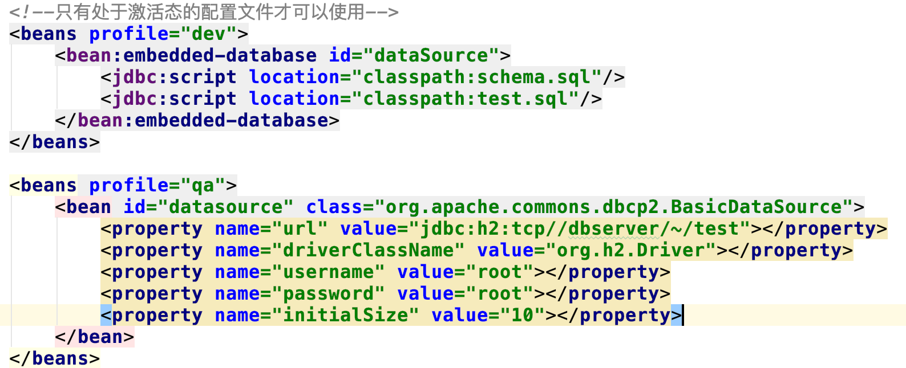

# Spring学习笔记
## 装配Bean
### 自动化装配
 在工程目录文件内"cn.edu.hust.autowriting"包内进行自动装配,学习到的知识有如下:
 
 @Autowired 注解可以放在任何想要的方法和属性中,表示注入,这与Spring的主要思想DI(依赖注入)有关
 
 @Component注解表示一个组件
 
 在XML配置中配置包的扫描,一般只是配置需要扫描的基础包,Spring可以扫描下面的子包了。
 
 具体的配置如下:
 
### JavaConfig配置
 在工程目录文件内"cn.edu.hust.javaConfig"包内进行自动装配,学习到的知识有如下:
 
 @ComponentScan 注解表示扫描的包，内部的属性有个basePackages,表示需要扫描的包,这是一个数组,可以扫描多个
 
 @Configuration 注解表示开发者可以像Java代码一项配置文件,但是切记不要和业务代码混合
 
 @Bean 注解来表示一个bean，一般方法的返回名字和bean的名字一样
### XML配置
 在使用XML配置之前,首先需要在XML配置文件的顶部声明多个XML模式文件,这些定义了配置Spring的XML元素。
 
 使用Spring至少要使用core内容,涉及的XML声明模式有beans、context;具体的配置如下:
 
 
 对于一般的beans配置情况,如果需要配置的类里面有例如setter等方法注入,具体配置如下:
 
 
 对于构造器的配置如下,这里可以有一个类在构造器中引用其他的bean,还有注入字面值以及集合的配置,具体情况如下:
 
 
### 总结
 根据应用场景的不同,各种配置的方法都有优缺点;有时候xml配置更加利于维护,有时候javaConfig的配置更加便利;有时候
 
 两者方法混合更加好,需要根据不同的应用场景选择。
 
## 高级装配
 在生产过程中,我们会发现如下的情况,很多在开发环境可以使用的配置在实际的情况下却不能适应,那么我们如何更好的
 
 在开发环境和生产环境中切换呢？这里我们使用prefile文件进行环境的切换。
 
### Java配置中切换
 这里需要使用@Profile注解进行切换,我们可以使用这个注解使用在不同的类上,Spring容器会根据不同的Profile来进行是否
 
 加载这个bean到Spring容器;当然在Spring3.1以后,我们可以将这个注解放在方法上面根据Profile的不同激活。
 
### XML配置文件中切换

 我们可以将整个配置文件进行prfile化,我们可以将所有的profile bean装配在整个配置文件中,这里我们需要进行如下的配置:
 

 当然,如果不方便的话,我们也可以使用的配置针对于同一个数据库连接管理池配置不同的bean,然后使用不同的profile激活
  
 
#### 那么如何激活profile呢?
 可以设置两个属性来激活profile
 
   spring.profiles.active 该属性是用来确定激活那个profle的
   
   spring.profiles.default 如果上面的属性没有设置,那么采用默认的激活
   
 如果以上两个值均没有设置,那么将没有profile激活
 
 我们可以使用多个方式来设置两个值:
 
  1.作为DispatchServlet的初始化参数
  
  2.作为Web应用的上下文参数
  
  3.作为JNDI条目
  
  4.作为环境变量
  
  5.作为JVM的系统属性
  
  6.在集成测试类上,可以使用@ActiveProfiles来进行测试
  
 我们可以在测试的时候使用@ActiveProfiles来激活profile
 
### 条件化bean
 如果你需要指定某一个bean在满足某种条件下进行创建,你可以使用@Conditional注解来进行条件话bean。
 
 @Conditional注解有一个属性classes来指定但满足某些条件的时候才开始实例化bean。
 
 内部的原理如下,如果满足条件,matches方法将会返回true;反之,则为
 
 

### 处理自动装配的歧义
 在工程目录文件内"cn.edu.hust.cancelMulti"包内进行处理自动装配的歧义demo
 
 有时候我们可能遇到这样的情况,如果实现某个接口的类不只一个,那么有个类需要依赖这个类,当需要注入的时候就会产生歧义.
 
 如何解决整个歧义呢? 歧义产生的错误是org.springframework.beans.factory.NoUniqueBeanDefinitionException
 
 对于经典的xml配置,我们可以在选定的bean中设置primary=true;如果在注解的配置中,我们可以配置@Primary
 
#### 限定自动配置的bean
 上面的注解只是优先的选用哪一个bean,如果使用上面的注解或者在xml配置还是有歧义,我们应该怎么办呢?
 
 我们可以使用限定的注解来进行配置,具体配置如下
 
 
 在实际的运行情况下,尽管我们可以配置了为一个@Primary注解,但是运行处理的结果还是@Qualifier注解配置的类的结果
 
 但是这里的@Qualifier需要指定类的ID,一般来说,类的id是类的首字母小写的单词,但是这个注解与id的名字是紧密耦合的
 
 所以我们可以现在选定的类上加上@Qualifier自定义一个合适的名字在进行注入.
 
### bean的作用域
 bean的作用域一般是单例的，但是在某种情况下，使用同一个实例可能污染。基于以上考虑，Spring创建了不同的作用域
 
 单例:在整个应用中,Spring只创建一个实例
 
 原型:每次注入或者获取Sring应用上下文都会创建一个新的bean实例.
 
 会话:在Web应用中,都会给每个会话创建一个bean实例。
 
 请求:在web应用中,为每一次请求创建一个bean实例。
 
 使用注解可以利用@Scope(ConfigurableBeanFactory.SCOPE_PROTOTYPE)这样来显示的表示bean的作用域,也可以使用
 
 字面量来进行，但是为了避免出错最好使用定义的常量来表示。
 
#### 会话bean和请求的bean

 设想一下这样的应用场景,需要为每一个用户的每一个会话创建一个购物车，显然bean作用域为单例是不对的
 
 如果bean的作用域为原型也是不对的，因为每一次注入或者加载上下文都会产生一个购物车
 
 我们需要的是什么呢，我们需要的是一个会话一个购物车，所以这里的作用域类型是会话
 
 还有一种情况是什么呢？如果我们需要在这里将都购物车注入到单例的bean中，这时没有用户登陆，那么就没有实例

 这个时候，我们需要指定一个代理模式来代理我们需要的，所有我们可以使用proxyMode属性
              
 如果代理的是接口，这里是ScopedProxyMode.INTERFACES,如果是类那么是ScopedProxyMode.TARGET_CLASS。
 
 
 对于整体的代理流程,用下面这张图可以表示
 
 
 如果需要在xml中配置bean的作用域,需要说明的是如果目标值那个设置为true使用cglib代理，可以使用如下的配置
 
 
### 运行注入值
 在工程目录文件内"cn.edu.hust.property"包内进行运行市注入值
 
 在前面几节的内容中，使用了硬编码，在实际生产环境中肯定是不行的所以要使用可配置的文件。
 
 这里如果使用注解，可以使用@PropertySource和Environment来实现,具体情况如下
 
 
 如果使用的xml配置文件的方式,可以使用如下配置方式来解析:
 