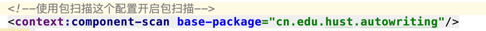

# Spring学习笔记
## 装配Bean
### 自动化装配
 在工程目录文件内"cn.edu.hust.autowriting"包内进行自动装配,学习到的知识有如下:
 
 @Autowired 注解可以放在任何想要的方法和属性中,表示注入,这与Spring的主要思想DI(依赖注入)有关
 
 @Component注解表示一个组件
 
 在XML配置中配置包的扫描,一般只是配置需要扫描的基础包,Spring可以扫描下面的子包了。
 
 具体的配置如下:
 
### JavaConfig配置
 在工程目录文件内"cn.edu.hust.javaConfig"包内进行自动装配,学习到的知识有如下:
 
 @ComponentScan 注解表示扫描的包，内部的属性有个basePackages,表示需要扫描的包,这是一个数组,可以扫描多个
 
 @Configuration 注解表示开发者可以像Java代码一项配置文件,但是切记不要和业务代码混合
 
 @Bean 注解来表示一个bean，一般方法的返回名字和bean的名字一样
### XML配置
