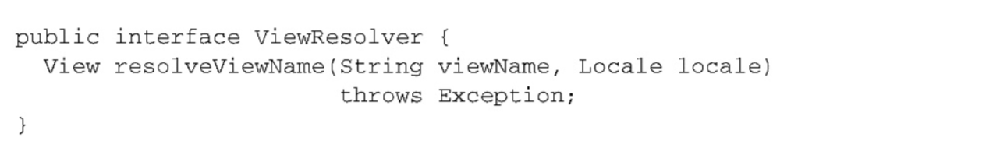
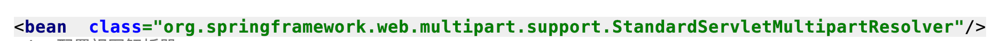
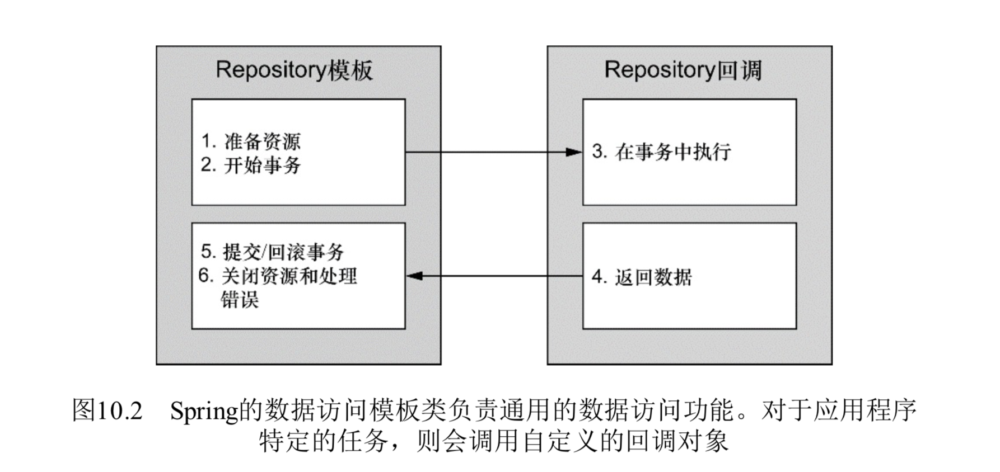

# Spring学习笔记
## 装配Bean
### 自动化装配
 在工程目录文件内"cn.edu.cn.edu.hust.autowriting"包内进行自动装配,学习到的知识有如下:
 
 @Autowired 注解可以放在任何想要的方法和属性中,表示注入,这与Spring的主要思想DI(依赖注入)有关
 
 @Component注解表示一个组件
 
 在XML配置中配置包的扫描,一般只是配置需要扫描的基础包,Spring可以扫描下面的子包了。
 
 具体的配置如下:
 
### JavaConfig配置
 在工程目录文件内"cn.edu.cn.edu.hust.javaConfig"包内进行自动装配,学习到的知识有如下:
 
 @ComponentScan 注解表示扫描的包，内部的属性有个basePackages,表示需要扫描的包,这是一个数组,可以扫描多个
 
 @Configuration 注解表示开发者可以像Java代码一项配置文件,但是切记不要和业务代码混合
 
 @Bean 注解来表示一个bean，一般方法的返回名字和bean的名字一样
### XML配置
 在使用XML配置之前,首先需要在XML配置文件的顶部声明多个XML模式文件,这些定义了配置Spring的XML元素。
 
 使用Spring至少要使用core内容,涉及的XML声明模式有beans、context;具体的配置如下:
 
 
 对于一般的beans配置情况,如果需要配置的类里面有例如setter等方法注入,具体配置如下:
 
 
 对于构造器的配置如下,这里可以有一个类在构造器中引用其他的bean,还有注入字面值以及集合的配置,具体情况如下:
 
 
### 总结
 根据应用场景的不同,各种配置的方法都有优缺点;有时候xml配置更加利于维护,有时候javaConfig的配置更加便利;有时候
 
 两者方法混合更加好,需要根据不同的应用场景选择。
 
## 高级装配
 在生产过程中,我们会发现如下的情况,很多在开发环境可以使用的配置在实际的情况下却不能适应,那么我们如何更好的
 
 在开发环境和生产环境中切换呢？这里我们使用prefile文件进行环境的切换。
 
### Java配置中切换
 这里需要使用@Profile注解进行切换,我们可以使用这个注解使用在不同的类上,Spring容器会根据不同的Profile来进行是否
 
 加载这个bean到Spring容器;当然在Spring3.1以后,我们可以将这个注解放在方法上面根据Profile的不同激活。
 
### XML配置文件中切换

 我们可以将整个配置文件进行prfile化,我们可以将所有的profile bean装配在整个配置文件中,这里我们需要进行如下的配置:
 

 当然,如果不方便的话,我们也可以使用的配置针对于同一个数据库连接管理池配置不同的bean,然后使用不同的profile激活
  
 
#### 那么如何激活profile呢?
 可以设置两个属性来激活profile
 
   spring.profiles.active 该属性是用来确定激活那个profle的
   
   spring.profiles.default 如果上面的属性没有设置,那么采用默认的激活
   
 如果以上两个值均没有设置,那么将没有profile激活
 
 我们可以使用多个方式来设置两个值:
 
  1.作为DispatchServlet的初始化参数
  
  2.作为Web应用的上下文参数
  
  3.作为JNDI条目
  
  4.作为环境变量
  
  5.作为JVM的系统属性
  
  6.在集成测试类上,可以使用@ActiveProfiles来进行测试
  
 我们可以在测试的时候使用@ActiveProfiles来激活profile
 
### 条件化bean
 如果你需要指定某一个bean在满足某种条件下进行创建,你可以使用@Conditional注解来进行条件话bean。
 
 @Conditional注解有一个属性classes来指定但满足某些条件的时候才开始实例化bean。
 
 内部的原理如下,如果满足条件,matches方法将会返回true;反之,则为
 
 

### 处理自动装配的歧义
 在工程目录文件内"cn.edu.cn.edu.hust.cancelMulti"包内进行处理自动装配的歧义demo
 
 有时候我们可能遇到这样的情况,如果实现某个接口的类不只一个,那么有个类需要依赖这个类,当需要注入的时候就会产生歧义.
 
 如何解决整个歧义呢? 歧义产生的错误是org.springframework.beans.factory.NoUniqueBeanDefinitionException
 
 对于经典的xml配置,我们可以在选定的bean中设置primary=true;如果在注解的配置中,我们可以配置@Primary
 
#### 限定自动配置的bean
 上面的注解只是优先的选用哪一个bean,如果使用上面的注解或者在xml配置还是有歧义,我们应该怎么办呢?
 
 我们可以使用限定的注解来进行配置,具体配置如下
 
 
 在实际的运行情况下,尽管我们可以配置了为一个@Primary注解,但是运行处理的结果还是@Qualifier注解配置的类的结果
 
 但是这里的@Qualifier需要指定类的ID,一般来说,类的id是类的首字母小写的单词,但是这个注解与id的名字是紧密耦合的
 
 所以我们可以现在选定的类上加上@Qualifier自定义一个合适的名字在进行注入.
 
### bean的作用域
 bean的作用域一般是单例的，但是在某种情况下，使用同一个实例可能污染。基于以上考虑，Spring创建了不同的作用域
 
 单例:在整个应用中,Spring只创建一个实例
 
 原型:每次注入或者获取Sring应用上下文都会创建一个新的bean实例.
 
 会话:在Web应用中,都会给每个会话创建一个bean实例。
 
 请求:在web应用中,为每一次请求创建一个bean实例。
 
 使用注解可以利用@Scope(ConfigurableBeanFactory.SCOPE_PROTOTYPE)这样来显示的表示bean的作用域,也可以使用
 
 字面量来进行，但是为了避免出错最好使用定义的常量来表示。
 
#### 会话bean和请求的bean

 设想一下这样的应用场景,需要为每一个用户的每一个会话创建一个购物车，显然bean作用域为单例是不对的
 
 如果bean的作用域为原型也是不对的，因为每一次注入或者加载上下文都会产生一个购物车
 
 我们需要的是什么呢，我们需要的是一个会话一个购物车，所以这里的作用域类型是会话
 
 还有一种情况是什么呢？如果我们需要在这里将都购物车注入到单例的bean中，这时没有用户登陆，那么就没有实例

 这个时候，我们需要指定一个代理模式来代理我们需要的，所有我们可以使用proxyMode属性
              
 如果代理的是接口，这里是ScopedProxyMode.INTERFACES,如果是类那么是ScopedProxyMode.TARGET_CLASS。
 
 
 对于整体的代理流程,用下面这张图可以表示
 
 
 如果需要在xml中配置bean的作用域,需要说明的是如果目标值那个设置为true使用cglib代理，可以使用如下的配置
 
 
### 运行注入值
 在工程目录文件内"cn.edu.cn.edu.hust.property"包内进行运行市注入值
 
 在前面几节的内容中，使用了硬编码，在实际生产环境中肯定是不行的所以要使用可配置的文件。
 
 这里如果使用注解，可以使用@PropertySource和Environment来实现,具体情况如下
 
 
 如果使用的xml配置文件的方式,可以使用如下配置方式来解析:
 

## 面向切面的Spring
 在软件开发中散布于多出的功能成为横切关注点,例如安全功能、日志功能等。
### 什么是面向切面变编程
 切面提供了继承和委托的另一种可选方案，而且在很多应用场景下更清晰简洁。在使用切面编程时,我们仍然需要在一个地方
 
 定义通用的功能，但是可以通过声明的方式定义这个功能要以何种方式要在何处应用，而无需修改影响的类。横切关注点可以
 
 被模块化为特殊的类，这些类被称为切面。这样做有两个好处:1.现在每个关注点都集中于一个地方，而不是分散在多处代码中;
 
 2.服务模块更加简洁，因为它们只包含核心功能点的代码。
 
#### 定义AOP术语
 描述切面的常用术语有通知、切点和连接点。
 
 切面功能织入程序的过程如下:
 
 
 在AOP术语中,切面的工作被称为通知。Spring有5种类型的通知:
 
 1.前置通知:在目标方法调用之前调用通知功能。
 
 2.后置通知:在目标方法调用之后调用通知,此时并不关心方法的输出是什么。
 
 3.返回通知:在目标方法成功执行之后调用通知。
 
 4.异常通知:在目标方法抛出异常之后调用通知。
 
 5.环绕通知:通知包裹了被通知的方法,在被通知的方法调用之前和调用之后执行自定义的行为。
 
 连接点:应用可能有数以千计的时机应用通知。这些时机成为连接点。连接点是在应用执行过程中能够插入切面的一个点。
 
 这个点可以是调用方法、抛出异常、甚至是修改一个字段时。
 
 切点:切点的定义会通知所要织入的一个或者多个连接点。通常是明确的方法或者类,或者是利用正则表达式所匹配的类和方法名
 
 来指定这些切点。
 
 切面:通知和切点的结合。
 
 织入:把切面应用到目标对象并创建的代理对象的过程。切面在指定的连接点被织入到目标对象中。
 
 在目标对象生命周期有多个点可以织入;
 
 1.编译期:切面在目标类编译时被织入。AspectJ是用这种织入方法织入切面的。
 
 2.类加载期:切面在目标类加载到JVM时织入。这种方式需要特定的类加载器,他可以把目标类被引用之前增强该目标类的字节码
 
 AspectJ 5的加载时织入就支持以这种方式织入切面。
 
 3.运行期:切面在运行的某个时候被织入。一般情况下，在织入的时候，AOP容器会为目标对象创建一个代理对象。
#### Spring对AOP的支持
 Spring提供了4种类型的AOP的支持:
 
 1.基于经典的Spring AOP
 
 2.纯POJO切面
 
 3.@AspectJ注解驱动的切面
 
 4.注入式AspectJ切面(适用于Spring各种版本)
 
 Spring AOP是基于动态代理的，所以都是方法拦截。
 
 Spring在运行时通知对象
 
   通过在代理类中包裹切面,Spring运行期把切面织入到Spring管理的bean中。代理类封装了目标类，并拦截被通知方法
   
   的调用，再把调用转发给真正的目标bean。
   
 Spring 基于动态代理，所以Spring只支持方法连接点。
 
### 通过切面来选择连接点
 在Spring AOP中，要用AspectJ的切点表达式语言来定义切点。
 
 Spring是基于代理的，而某些切点表达式是与基于代理的AOP无关的。
 
 关于Spring基于AspectJ的切点表达式如下:
 
 
#### 编写切面
 1。首先定义一个接口
 '''
 
 public interface Watch {
     void watch();
 }
 
 '''
 
 2。编写切面
 
 
 3。编写目标类
 
 
 4。关于AspectJ注解来声明通知方法
 
 
 需要使用@EnableAspectJAutoProxy和在xml配置文件中启动aop，xml配置如下
 
 <aop:aspectj-autoproxy/>
 
#### 创建环绕通知
 环绕通知是最强大的通知类型。它能将你写的逻辑通知目标方法完全包装起来。

 创建环绕通知如下:
 
 
#### 处理通知中的参数
 以前处理的通知方法中，没有处理方法中有参数的情况；这里可以像以前一样定义，不过可以使用AspectJ的表达式来表示
 
 在前一小节中，我们只需要添加"&&args(形式参数)"。具体的情况如下
 
 
#### 通过注解添加新的功能
 利用被称为引用的AOP概念，切面可以为Spring bean添加方法。
 
 
 
 这里涉及@DeclareParents注解，可以利用Spring AOP的功能添加新的方法。
 
### 在XML中声明切面
 在切面类中，以前的通知方法或者类都是通过AspectJ注解来实现的，这里只需要移除这些注解在XML配置即可。
 
 首先是在XML配置aop切面配置文件如下
 
 
 对于环绕通知类似与传递参数与注解，这里我们仅仅需要修改配置文件即可。
 
 
## 构建Spring web应用程序
### Spring MVC起步
 Spring把请求在调度Servlet、处理器映射、控制器以及视图解析器之间移动；每一个Spring MVC中的组件都有特定
 
 的目的，并且它没有那么那么复杂。请求在SpringMVC的流程如下
 
 
 请求的第一站首先要经过Spring的DispatchServlet，与大多数Java的web一样，Spring MVC的所有请求
 
 都会经过一个前端控制器Servlet。前端控制器是常用Web应用程序模式，在这里一个单实例的servlet将请求委托给
 
 应用程序的其他组件来执行实际处理，在SpringMVC中，DispatchServlet就是前端控制器。
 
 DispatchServlet的任务是将请求发给Spring MVC的控制器，控制器是一个用于处理请求的Spring组件。由于
 
 控制器存在多个，首先要确定该请求交给哪一个控制器处理，这就首先要交给处理器映射器来进行请求的判断。
 
 处理器请求映射器根据请求携带的URL信息来进行决策。一旦决定由那个控制器来处理，DispatchServlet就直接交个
 
 这个控制器，然后处理完成后就会产生一些信息，这些信息需要返回给用户浏览器呈现给用户。这些信息称之为模型。
 
 控制器还需要做的一件是事情就是将模型数据打包，然后标出用于渲染的视图名，将这些信息发给DispatchServlet
 
 。DispatchServlet将会使用视图解析器来将逻辑视图来进行特定的视图实现，最后一步是视图的实现，进行视图渲染。
 
#### 搭建Spring MVC
 DispatchServlet是Spring MVC的核心，它负责将请求路由发送到其他组件中。
 
 DsipatchServlet这样的Servlet可以配置在web.xml中，这个文件放置在war包里面。
 
 这里使用Java方式将DispatchServlet配置在web.xml文件中。
 
 对于一般的项目配置都在web.xml配置中,这里只是记录web.xml的配置,web.xml配置如下
 
 
 Spring一般需要加载两个Spring应用上下文,首先是我们这里配置SpringMVC的应用上下文
 
 然后这里需要配置视图解析器,将SpringMVC和Spring beans配置分开配置
 
 
 对于一般的Spring Beans配置如下:
 
 
### 编写一般的控制器
 编写一般额控制器，使用@Controller来声明控制器;在一般的方法中,使用@RequestMapping注解在方法中声明请求路径
 
 
 在这个控制器中,返回的值表示需要渲染的视图名称 DispatchServlet要求视图解析器将这个逻辑的视图转化为实际视图
 
 如果觉得控制器的请求路径较大可以在类级别上使用@RequestMapping窄化请求路径。
 
#### 数据模型传递到视图
 如果需要将参数传递到视图中，需要怎么解决呢?在上一节中,可以将数据放在Model中,然后在jsp中配置即可。
 
 传递到视图需要注意的是页面jsp中,需要与上图中的model的名字一致,然后在jsp中使用${person.name}取值
 
### 接收请求的参数
 SpringMVC允许以多种方式将客户端中的数据传递到控制器的处理方法中,包含:
 1.查询参数
 
 2.表单参数
 
 3.路径参数
 
#### 处理查询参数
 @RequstParam注解可以将请求的参数传递到控制器中的处理方法.具体如下
 
 这里需要注意的是如果有多个参数,我们需要将子啊@RequstParam注解中写出value属性，当然也可以配置默认的值
 
#### 通过路径参数接收输入
 在上一小节中,需要在请求路径后添加请求参数,对于现在较流行的处理是在请求路径上传递参数.
 
 这里使用,@PathVariable来接收。
 
 
 如果路径的参数名称和参数的名称相同可以省略@PathVariable的value，这里@RequestMapping路径的参数需要用{}括起来
 
#### 处理表单
 处理表单的是在jsp表中使用form的标签来定义一个表格,这里需要将属性配置在jsp中。
 
 
 如果需要验证表单的属性,可以使用如下的注解
 
 
## 渲染视图
### 理解视图渲染
 将控制器中请求处理的逻辑和视图中的渲染实现解耦是SpringMVC的重要特性。
 
 一般额，我们使用InternalResourceViewResolver的视图解析器。在它的配置中，为了得到视图的名字需要配置前置和后置。
 
 SpringMVC定义了一个名为ViewResolver的接口,大致如下
 
 当给接口中的方法传入一个视图名和Locale的对象时,返回一个View实例。View是另一个接口如下:
 
 View接口的任务是接收模型以及Servlet的request和response对象,然后将结果输出到response中渲染。
 
 Spring自带13个视图解析器,能都将逻辑视图转化为物理视图:
 
 
 
 InternalResourceResolver一般用于JSP,TilesViewRsovler用于Apache Tiles视图，而FreeMakerViewResovler
 
 和VelocityViewResolver分别对应FreeMaker和Velocity模板视图。
 
 Thymeleaf是一种用于替代JSP的新兴技术,Spring提供用于ThymeLeaf的原生模板协作的视图解析器，它最终产生的HTML。
### 创建JSP视图
 Spring提供了两种支持JSP视图的方式:
   1.InternalResourceViewResolver会将视图名解析为JSP文件。另外，在JSP使用JSTL标签库，InternalResourceViewResolver
   
   能够将视图名解析为JstlView形成的JSP文件,从而将JSTL本地化和资源bundle变量给JSTL的格式化和信息标签。
   
   2.Spring提供了两个JSP标签库,一个用于表单到模型的绑定,另一个提供了通用的工具类特性。
#### 配置适用于JSP视图解析器
 有一些视图解析器,例如InternalResourceResolver会直接将视图名映射为特定的View的接口实现,
 
 InternalResourceResolver所采取的方式并不直接，它遵循一种约定,会在视图名上添加前缀和后缀,进而确定
 
 一个Web应用中视图资源的物理路径。基于XML配置如下
 
 
 当返回的视图有"/"时会将这个斜线带到资源路径中.

 如果这里想将一般的JSP使用JSTL标签来处理信息格式,我们需要使用InternalResourceViewResolver将视图解析为JstlView
 
 可以使用如下的配置,在原来的配置中设置它的viewClass即可
 
#### 使用Spring中的JSP库
 Spring提供了两个JSP标签库,用来帮助定义Spring MVC Web的视图.其中一个标签库会使用来渲染HTML表单标签
 
 这些标签可以绑定model中的某个属性。另一个标签库包含了一些工具类标签。
 
 Spring的表单绑定JSP标签库包含14个标签,它们中的大多数都用来渲染HTML中的表单标签。
 
 首先我们必须在JSP中声明,具体如下:
 
 
 对于一般的Spring绑定标签有:
 
 
 
 这里又一个提交表单使用Spring表单绑定标签渲染,具体如下:
 
 在这里,一定要设置modelAtrribute属性，这样Spring才能渲染,不然会出现JSP错误。
 
 在控制器的方法层面,一定要出现model,model的属性设置里面需要有modelAtrribute属性设置的键值对。
 
 那么如果出现错误如何显示在页面呢? 可以使用上面的error标签即可
 
 Spring中的通用标签
  Spring除了绑定表单标签外也有更加通用标签。如果要使用，首先必须配置如下:
  
  
  Spring的一些通用标签:
  
## SpringMVC的高级技术
 在了解完Spring基本的用法之后,我们可以解决基本的问题,但是还需学习比较高级的基础知识,我们在这一章继续学习。
### 处理multipart形式的数据
 对于一般的参数提交,我们我们可以在提交路径中提交,以键值对进行,如果碰见多种键值对,那么可以使用&来进行分割
 
 但是对于二进制数据,那么就不可能,需要使用multipart格式来进行。
 
 如果需要上传文件,那么可能需要配置multipart解析器,通过它告诉DispatcherServlet如何读取multipart。
#### 配置multipart解析器
 DispatchServlet并没有实现任何解析multipart请求数据的功能。它将该任务委托给了Spring中的MultipartResolver
 
 策略接口的实现，通过实现类来解析multipart请求中的内容。Spring内置了两个MultipartResolver提供我们选择:
 
 1.CommonsMultipartResolver:使用Jackrta Commons FileUpload解析multipart请求
 
 2。StandardServletMultipartResolver：依赖Servlet3。0对multipart请求的支持
 
 StandardServletMultipartResolver可能是更加优秀的选择,因为并不依赖于其他项目,如果Servlet3.0的容器，或者没有
 
 Spring3。1那么就需要使用方案1。
 
 使用Servlet 3。0解析multipart请求,下面配置如下:
 
 1.首先在SpringMVC的xml文件中配置StandardServletMultipartResolver的bean,具体的配置如下:
 
 
 2.在web.xml配置中配置临时文件存储的位置,以及上传的文件最大大小和最小大小
 
 
 3.处理multipart请求
  对于一般的multipart上传处理,可以使用byte[]数组,保存在目标地址即可,但是我们可能需要想要的更多,Spring为我们
  
  提供了一个接口MultipartFile用来加载需要的信息,MultipartFile接口的定义:
  
  我们这里的处理信息如下:
  
  在数据处理部分,我们需要使用@Requestpart注解来接收请求的Multipart参数。
  
  在一般的情况下,我们可以使用Part接口与MultipartFile类似,具体方法如下:
  
  
 使用CommonsMultipartResolver解析multipart请求:
 1.首先要引用依赖的jar包,commons-io jar包和commons-uploadfile jar包
 
 
 2.配置CommonsMultipartResolver的bean
 
 
 3。处理multipart请求
 
   在数据处理部分,我们需要使用@Requestpart注解来接收请求的Multipart参数。
 
 这里需要注意的是在SpringMVC的配置文件中的MultipartResolver解析器的id如下:
 
 
### 处理异常
 Spring提供了多种方式将异常转换为响应:
 1.特定的Spring异常将会自动映射为指定的Http状态码
 
 2.异常上可以添加@ResponseStatus注解,从而将其映射成为某一Http状态码
 
 3.在方法上添加@ExceptionHanlder注解,使其用来处理异常
#### 将异常映射为Http状态码
 Spring会将自身的一些异常自动转换为适合的状态码,具体的映射表如下:
 
 这里声明一个异常,然后使用@ResponseStatus注解在声明的异常中将异常转换
 
 
 在Controller的方法上添加测试的,具体配置如下
 
#### 编写异常处理的方法
 在上面的章节中,只是将服务器异常(错误代码500)转化为客户端异常400,显然这只是在特定的场景下使用。
 
 将异常和错误更好的处理，并且优雅的展示出来是个比较不错。
 
 对于在控制器的方法中,对于异常的处理方法一般如下:
 
 如果我们能专注于处理正常情况,我们的代码是否更加优雅呢?
 
 可以是使用@ExceptionHandler注解配置用于处理特定的异常,具体的配置如下:
 
  这个方法可以处理该控制器抛出的Exception异常,如果需要配置特定的异常,更改方法内的类即可。
### 为控制器添加通知
 上面只是解决了一个控制器抛出的特定异常,有没有可以处理所有控制器抛出的某一个特定异常呢?这一章将会具体介绍.
 
 Spring3.2为上述的问题引入了一个新的解决方法:控制器通知。控制器通知是任意带@ControllerAdvice注解的类,
 
 这个类包含一个或多个如下的类型方法:
 
 1.@ExceptionHandler注解标注的方法
 
 2.@InitBinder注解标注的方法。
 
 3.@ModelAttribute注解标注的方法。
 
 在带有@ControllerAdvice注解的类中,以上所述方法会运用到整个应用程序所有的控制器中的带有的@RequestMapping
 
 @ControllerAdvice注解本身带有@Component注解,所以在该注解标注的类中会自动被扫描。
 
 @ControllerAdvice最为实用的一个场景是将所有的@ExceptionHandler方法收集到一个类中，这样异常的处理都集中
 
 在一起处理。
 
 具体的配置如下:
 
### 跨重定向请求传递数据
 当一个处理器方法完成之后，该方法所指定的模型数据将会复制到请求中，请求会转发到视图进行渲染。因为控制器方法和
   
 视图所处理的是同一请求。所以在转发的过程中，请求属性能够得以保存。  
 
 当控制器的结果是重定向，原始请求结束请求会发起一个新的GET请求。原始请求中的所带模型数据将会随着请求一起消失。
 
 
 能够从发起到重定向的方法传递数据给处理重定向方法:
 1.使用URL模板以路径变量和/或查询参数的形式传递数据
 
 2。通过flash属性发送数据
 
#### 通过URL模板进行重定向
 通过重定向中设置模板就可以避免上述数据的丢失
 
 如果有多个参数需要传递可以在model中设置，但是这个方法只是可以传递简单类型的参数。
#### 使用flash属性
 在上述的参数传递中，这里仅仅只是传递了简单类型，如果遇到复杂对象，就要使用这种。
 
 Spring提供了将数据发送为flash属性的功能，主要通过Model的一个子接口RedirectAttribute来实现。
 
 具体的设置如下:
 
 flash设置后流程如下:
 
## 使用Spring Web Flow
 Spring Web Flow是一个Web框架,适用于元素按规定流程运行的程序。
### 在Spring中配置Web Flow
 Spring Web Flow是构建于Spring MVC基础之上的,这意味着所有的流程请求都需要首先经过Spring MVC的DispatchSerlvet。
 
 我们需要在Spring的应用上下文中配置一下bean来处理流程请求并执行流程。
#### 装配流程执行器
 流程执行器驱动流程的执行。当用户进入一个流程时,流程执行器会为用户创建并启动一个流程执行实例。当流程暂停的时候(如为用户展示视图)
 
 流程执行器会在用户执行操作后恢复流程。
 
 在Spring中创建一个流程执行器如下:
 
 流程执行器负责创建和执行流程，但它并不负责加载流程定义。这个责任落在流程注册表上。
#### 配置流程注册表
 流程注册表的工作是加载流程定义并让流程执行器能够使用它们。
 
 流程注册表的配置如下:
 
 通过base-path属性来确定流程定义，依据<flow:flow-location-pattern>元素的值，任何文件以"-flow.xml"结尾的xml文件都将视为
 
 流程定义。所有的流程都是通过其ID来进行引用，这了星号表示流程id。
 
 流程定义中的流程ID计算:
 
#### 处理流程请求
 对于流程而言,我们需要一个FlowHandlerMapping来帮助DispatchServlet将流程请求发送Spring Web Flow。
 
 在Spring应用上下文,FlowHandlerMapping的配置如下:
 
 FlowHandlerMapping中配置了流程注册表,这样它就知道如何将请求的URL匹配到流程中。
 
 FlowHandlerMapping的工作仅仅是将流程请求定向到Spring Web Flow上,响应请求是FlowHandlerAdapter。
 
 FlowHandlerAdapter等同于Spring MVC的控制器,它会响应发送的流程请求并对其进行处理。具体装配如下:
 
 这个处理器是DispatcherServlet和Spring Web Flow的桥梁。它处理流程请求并管理基于这些请求的流程。
 
 在这里,它装配了流程执行器的引用,而后者是为所处理的请求执行流程。
### 流程的组件
 在Spring Web Flow中，流程主要由三个元素定义:状态、转移和流程数据。状态是流程中事件中的地点。
 
 流程中的状态是业务逻辑执行、作出决策或者将页面展会给用户的地方。
 
 如果流程状态就像公路旅行中停下来的地点,那转移就是链接这些点的公路。在流程中，你通过转移的方式从这一个状态
 
 到另一个状态。在流程处理中,它要收集一些数据:流程的当前状况。
#### 状态
 Spring Web Flow定义了五种不同类型的状态。通过选择Spring Web Flow的状态几乎可以把任意的安排功能构造
 
 成会话式的Web应用。Spring Web Flow的几种状态如下:
 
 
 视图状态
 
  视图状态用于为用户展现信息并使用户在流程中发挥作用,实际的视图实现可以是Spring支持的任意视图类型,但通常是用JSP实现。
  
  在流程定义的XML文件中,<view-state>用于定义视图状态:<view-state id="welcome"></view-state> 
 
  id属性有两个含义.它在流程内标示这个状态。除此之外，因为在这里没有在其他地方指定视图，所以它也指定了流程到达这个状态
  
  时要展示的视图名为welcome。
  
  如果需要显示的指示另一个视图,这里使用view属性<view-state id="welcome" view="greeting"></view-state>
  
  如果流程为用户展现一个表单,可能希望指明表单会绑定的对象，可以设置model属性:<view-state id="welcome" view="greeting" 
  
  model="flashScope.person"></view-state>绑定在流程中的person对象中。
  
 行为状态
 
  视图状态会涉及到流程应用程序的用户，而行为状态则是应用程序自身在执行状态。行为状态一般会触发Spring管理的bean
  
  的一些方法并根据方法调用的执行结果转移到另一种状态。
  
  行为状态声明如下:
  
  expression属性指定了进入这个状态时要评估的表达。这里给出的时spEl表达式,指出要找到OrderFlowAction的bean调用saveOrder方法
  
 决策状态
  
  决策状态能够在流程执行时产生两个分支。决策状态将评估一个Boolean类型的表达式,然后在两个状态转移中选择一个，这要取决于表达式
  
  会计算出true还是false.xml中的决策定义如下:
  
  <if>元素是决策状态的核心。这是表达进行评估的地方,如果表达式结果为true,流程将转移到then属性指定的状态中;
  
  如果结果为false,流程会将转移到else属性执行的状态中。
  
 子流程
  
  <subflow-state>允许在一个正在执行的流程中调用另一个流程.这类似于一个方法中调用另一个方法。
  
  <input>元素用于传递订单对象作为子流程的输入。如果子流程结束的<end-state>状态ID为orderCreated那么将会转移为payment状态。
 
 结束状态
  最后,所有的流程结束。这就是当流程转移到结束状态是所做的。<end-state>元素指定了流程结束。声明如下:
  
  当到达<end-state>状态,流程会结束。接下来会发生啥,那么将会取决于几个因素:
  
  1.如果结束的流程是一个子流程,那调用它的流程将会从<subflow-state>处继续执行。<end-state>的ID将会
  
  用作事件触发从<subflow-state>开始的转移。
  
  2.如果<end-state>设置了view属性,指定的视图将会渲染。视图可以是相对于流程路径中的模板，如果添加"extenalRedirect:"
  
  前缀的话,将会重定向到流程外部的页面,如果添加了"flowRedirect:"将会重定向到另一个流程中。
  
  3.如果结束的流程不是子流程,也没有指定的view属性,那这个流程只会是结束而已。浏览器最后将会加载流程的基本URL地址，
  
  当前已没有活动的流程,所以会开始一个新的流程实例。
#### 转移
 流程中除结束状态之外的每个状态,至少需要一个转移,这样就能够知道一旦这个状态完成时流程要到哪里。状态可以有多个转移,
 
 分别对应于当前结束时可以执行不同的路径。
 
 转移使用<transition>元素用来定义,它会作为各种状态元素的子元素。
 
  <transition to="thankYou"/>
  
  如果这里只是使用了to属性,那这个转移状态就会是当前状态的默认转移现选项,如果没有其他可用转移的话,就会使用它。
  
  转移定义是基于事件的触发来进行。在视图状态,事件通常会是用户采取的动作,在行为状态,事件是评估表达式得到的结果。
  
  我们可以使用on属性来指定触发转移的事件:<transition on="orderCreated" to="payment"/>
  
  在上面的xml配置中,触发orderCreated事件,流程将会进入payment状态。
  
  在抛出异常时,流程也可以进入另一个状态。具体配置如下:
  
  如果出现上述异常,将会转移的注册流程。
  
 全局流程
  
  在创建完流程之后,可能需要有一些通用的流程转移。如果多个转移都是重复通用的转移,我们可以<global-transitions>
  
  具体的配置如下:
  
  <global-transitions>
      <transition on="cancel" to="endState"/>
  </global-transitions>
  
  定义完这个全局流程之后,流程中的所有流程都会默认拥有这个cancel转移。
 
#### 流程数据
 当流程从一个状态进行到另一个状态时,它会带走一些数据。有时候,这些数据只需要很短时间,有时候,这些数据会在整个
 
 流程中传递并在流程结束的时候用。
 
 声明变量
  
  流程数据保存变量中,而变量可以在流程的各个地方引用。<var name="person" class="cn.edu.cn.edu.hust.bean.Person"/>
  
  创建一个Person的实例,放在名为person的变量中,这个变量可以在流程的任意状态访问。
  
  作为行为状态的一部分作为视图状态的入口,可以使用如下声明:
  
  <evaluate expression="T(cn.edu.cn.edu.hust.bean.Person).asList()" result="viewScope.personList"/>
  
  <evaluate>元素计算一个表达式将结果放到名为personList的变量中,这个变量是视图作用域的。
  
  <set name="flashScope.person" value="new cn.edu.cn.edu.hust.bean.Person()" />
  
  上述是将变量设置为表达式计算的结果。
  
 定义流程数据的作用域
  
   流程中携带的数据会拥有不同的生命作用域和可见性,这取决于保存数据的变量本身作用域。
   
   Spring Web Flow的作用域:
   
 
   当使用<var>元素声明变量时,变量始终是流程作用域的,也就是在定义变量的流程内有效.当使用<set>或<evaluate>
  
   的时候,作用域通过name或result属性的前缀指定。
   
### 组合起来:披萨流程
 
## 保护Web应用
### Spring Security简介
 Spring Security是基于Spring的应用程序提供了声明式安全保护的安全性框架。
 
 Spring Security提供了Web请求级别和方法调用级别处理身份认证和授权。
 
 Spring Security充分利用了依赖注入和面向切面的技术。
 
 Spring Security使用了Servlet规范中的Filter保护Web请求并限制URL级别的访问。
 
 Spring Security还能使用Spring AOP保护方法调用。
 
#### 理解Spring Security的模块
 Spring Security的11个模块如下:
 
 应用程序的类路径下至少要包含Core和Configuration这两个模块。
#### 过滤Web请求
 Spring Security借助一系列Servlet Filter来提供了各种安全性功能。
 
 要启动Spring Security功能,我们需要在web.xml中配置一个Filter,DelegatingFilterProxy
 
 是一个特殊的Servlet Filter,它本身所做的功能并不多。只是将工作委托给javax.servlet.filter实现类
 
 这个实现类作为一个<bean>注册到Spring应用上下文中。流程如下:
 
 如果喜欢传统的xml配置,可以在web.xml配置filter,具体配置如下:
 
 这里重要的是将<filter-name>设置为springSecurityFilterChain,DelegatingFilterProxy会将过滤逻辑委托给他。
 
 springSecurityFilterChain本身是另一个特殊的Filter,它也被称为FilterChainProxy,它可以链接任意一个
 
 或多个其他的Filter.SpringSecurity依赖一系列Servlet Filter来提供不同的安全特性。
#### 编写简单的安全性配置
 启用安全配置的最简单配置如下:
 
 @EnableWebSecurity注解将会启用Web安全功能。SpringSecurit必须配置一个实现了WebSecurityConfigurer的bean
 
 扩展WebSecurityConfigurerAdapter。在Spring的上下文中,任何实现了WebSecurityConfigurer的bean都可以用来配置
 
 Spring Security,但是最简单的方式还是扩展WebSecurityConfigurerAdapter。
 
 @EnableWebSecurity可以启用任意web应用的安全性功能,不过，如果你的应用使用的是Spring MVC开发,那么你可以使用
 
 @EnableWebMvcSecurity代替这个注解。
 
 我们可能希望指定Web安全的细节,通过重载WebSecurityConfigurerAdapter中的一个或者多个方法来实现。可以通过
 
 重载WebSecurityConfigurerAdapter的三个configure()方法来配置安全性。具体如下
 
### 选择查询用户详细信息的服务
#### 使用基于内存的用户存储
 安全配置类扩展了WebSecurityConfigurerAdapter,因此配置用户存储的最简单方法是重载configure()方法,并以AuthenticationManagerBuilder
 
 作为传入参数,AuthenticationManagerBuilder有多个方法可以用来配置SpringSecurity对认证的支持。通过
 
 inMemoryAuthentication()方法,可以启用、配置并任意填充基于内存的用户存储。
 
 
 roles()方法是authorities()方法的简写形式。roles()方法所给定的值都会添加一个"ROLE_"前缀,并将其作为
 
 权限授予给用户。配置用户详细信息的方法:
 
 在测试的时候,基于内存的存储可能是比较理想的,但是在生产换的时候,这不是很合适。
#### 基于数据库的用户认证
 为了配置SpringSecurity使用以JDBC为了支撑的用户存储,使用jdbcAuthentication()方法,配置如下
 
 
## 通过Spring和JDBC征服数据库
### Spring的数据访问哲学
 为了避免应用与特定的数据访问策略耦合在一起,编写良好的Repository应该以接口的方法暴露功能。展示数据访问层如下:
 
 面向接口编程的好处:
 
 1.它使得服务对象易于测试,因为他们不用考虑与特定的数据访问实现绑定在一起
 
 2.接口是现实松耦合代码的关键,并且应该将其用于应用程序的各个层,而不仅仅是持久层。
#### 了解Spring的数据访问异常体系
 可能导致SQLException的常见问题包括:
  1.应用程序无法链接数据库
  
  2。要查询的SQL语句存在语法错误
  
  3。查询中所使用的表或列不存在
  
  4。试图插入或更新的数据违反数据库约束
  
  Spring提供的与平台无关的持久化异常
  
  不同于JDBC, Spring提供了多个数据访问异常,分别描述了它所抛出时对应的问题。
  
  Spring的部分数据异常与JDBC的提供的数据异常如下:
  
  
#### 数据访问模块
 Spring在数据访问中所使用的模式是模板模式:
 
 1.在某些特定的步骤上,处理过程中会将其工作委派给子类来完成一些特定实现的细节,这就是过程中变化的部分。
 
 2。模板方法将过程中与特定实现相关的部分委托给接口,而这个接口的不同实现定义了过程的具体行为。
 
 Spring将数据访问部分的固定和可变部分明确划分成为不同的类:模板和回调。模板管理过程中固定的部分
 
 而回调处理自定义的数据访问代码.下图展示了两个类的职责.
 
 Spring模板类处理数据访问的固定部分-事务访问、管理资源和处理异常。
 
 Spring的回调实现部分-语句、绑定参数和整理结果集。
### 配置数据源
 无论选择那种Spring的数据访问方式,都需要配置一个数据源的引用。
 
 Spring提供了在Spring上下文中配置数据源bean方式,包括
 
 1.通过JDBC驱动程序定义的数据源
 
 2。通过JNDI查找到数据源
 
 3。连接池的数据源
#### 使用JNDI数据源
 这种配置的好处在于数据源完全可以在应用程序之外进行管理,这样应用程序只需要在访问数据库的时候查找 
 
 数据源就可以了。
#### 使用数据源连接池
 数据源连接池:
 
 1.DBCP
 
 2.c3p0
 
 4.BoneCP
 
 一般主流的选择DBCP或者c3p0,这里主要介绍dbcp链接,具体配置如下:
 1.首先映入相关jar包
 
 
 2.配置数据库相关链接
 
 
 关于dbcp连接池相关配置:
 
### 在Spring中使用JDBC
 首先在Spring中配置jdbcTemlapte的bean,防止以后繁琐的sql操作
 
 
 然后在相关的dao层配置适合的dao实现
 
 
 最后根据相关方法查询即可
## 使用对象-关系映射持久化数据
 延迟加载:随着我们的对象关系变得越来越复杂,有时候我们并不希望立即获取完整的对象间关系。
 
 预先抓取:这与延迟加载是相对的.借助于预先抓取，我们可以使用一个查询完整的关联对象。
 
 级联:有时候更改数据库中的表会同时修改其他的表。
 
 Spring对多个持久化框架提供了支持，包括Hibernate、JPA等。Spring对这些ORM框架提供了集成服务以及一些附带
 
 的服务:
 
 1.支持集成Spring声明式事务
 
 2。透明的异常处理
 
 3。线程安全的、轻量级的模板
 
 4。DAO支持类
 
 5。资源管理
 
### 在Spring中集成Hibernate
#### 声明Hibernate的Session工厂
 使用Hibernate所需要的接口是org.hibernate.Session.Session接口t提供了基本的数据访问功能、如保存、
 
 更新、删除以及从数据库中加载对象的功能。通过Hibernate的Session接口，应用程序的Repository能够满足所有的
 
 持久化需求。
 
 获取 Hibernate Sessiond对象的标准是借助于Hibernate SessionFactory接口的实现类。
 
 除了一些其他任务,SessionFactory主要负责Hibernate Session的打开、关闭。
 
 Spring提供了3个Session工厂 bean:
 
 1.LocalSessionFactoryBean
 
 2.AnnotationSessionFactoryBean
 
 3.LocalSessionFactoryBean
 
 基于注解的配置如下:
 
#### 构建不依赖于Spring的Hibernate代码
 这里我们要构建一个Hibernate的DAO配置
 
 为了给不使用模板的Hibernate Repository添加异常转化功能,我们需要在Spring应用上下文中添加一个
 
 PersistenceExceptionTranslationPostProcessor bean即可。
### Spring与Java持久化API
 JPA是基于POJO的持久化机制,它从hibernate和Java数据对象上借鉴了理念并加入了Java5注解的特性。
 
 在Spring中使用JPA的第一步是要在Spring应用上下文将实体管理器工厂按照bean进行配置。
 
#### 配置实体工厂管理器
 基于JPA的应用程序需要使用EntityManagerFactory的实现类来获取EntityManager实例。JPA定义了两种类型
 
 的实体管理器:
 
 1.应用程序管理类型:当应用程序向实体管理器工厂直接请求实体管理器时,工厂创建一个实体管理器。这种模式下,程序
 
 要负责或实体管理器并在事务中对其进行控制。这种方式的实体管理器适合于不运行在JavaEE容器中的独立应用程序。
 
 2.容器管理类型:实体管理器由JavaEE创建和管理。应用程序根本不与实体管理器工厂打交道。相反,实体管理器直接通过
 
 注入或JNDI来获取。容器负责配置实体管理器工厂。
 
 以上的实体管理器都实现了同一的EntityManager接口。关键区别不在于EntityManager本身,而在于EntityManager的创建
 
 和管理方式。应用管理类型的EntityManager是由EntityMangerFactory创建的,而后者是通过PersistenceProvider的
 
 createEntityManagerFactory()方法得到。与持相反,容器管理类型的EntityManagerFactory是通过PersistenceProvider
 
 的createContainerEntityManagerFacotry()方法得到。
 
 这两种实体管理器工厂分别对应由对应的Spring工厂Bean创建:
 
 1.LocalEntityManagerFactoryBean生成应用程序管理类型的EntityManagerFactory
 
 2.LocalContainerEntityManagerFactoryBean生成容器管理类型的EntityManagerFactory
 
 配置应用程序的JPA
 
  绝大部分的配置信息来源于一个名为persistence.xml配置文件。这个文件必须位于路径下的META-INF目录下
  
  persistence.xml的作用在于定义一个或多个持久化单元。持久化单元是同一个数据源下的一个或多个持久类。
  
  具体配置如下:
  
  由于xml配置文件中已经配置了大量的持久化单元以及数据库连接的相关信息,一般的注解配置就显得非常少如下:
  
  创建应用管理类型的EntityManagerFactory都是在persistene.xml中进行的,而正是应用程序管理的本意。
  
  在应用程序管理的场景下,完全由应用程序本身来负责获取EntityManagerFactory,这就是通过JPA实现的
  
  PersistenceProvider做到的。如果每次请求EntityManagerFactory时需要定义持久化单元,那代码将会膨胀,
  
  通过将其配置在persistence.xml中,JPA就能够在这个特定的位置查找到持久化单元。
  
 使用容器管理类型的JPA
  
  当运行在容器中,可以使用容器(在我们的容器中是Spring)提供的信息来生成EntityManagerFactory。
  
  可以使用@Bean注解来配置,具体配置如下:
  
  jpaVendorAdapter属性用于指明所使用的是哪一个厂商的JPA实现,Spring提供了多个JPA适配器:
  
  1.EclipseLinkJpaVendorAdapter
  
  2.HibernateJpavendorAdapter
  
  3.OpenJpaVendorAdapter
  
  这里我们配置Hibernate-JpaVendorAdapter,配置如下:
  
  设置厂商适配器,主要的是database属性,这个属性支持如下:
  
  我们可以在HibernateJPAVendorAdaptor设置扫描的包,那么只需要扫描带有@Entity注解的类。
  
 从JNDI获取实体管理器工厂
  
  如果将Spring应用程序部署在应用服务器中,EntityManagerFactory可能已经创建好了并且位于JNDI中等待
  
  查询使用。在这种情况下,可以使用Spring jee命名空间下的<jee:jndi-lookup>元素来获取EntityMangerFactory
  
  的引用:
  
  可以使用如下的Java配置获取
  
#### 编写基于JPA的Repository
 Spring对JPA集成也提供了JpaTemplate模板以及对应的支持类JpaDaoSupport.
 
 下面是使用容器管理器的配置:
 
 1.配置EntityManagerFactory
 
 2.编写DAO层
 
### 借助Spring Data实现自动化的JPA repository
 对于很多Dao层下面的实现有很多相同的模板方法,我们不需要一遍地编写相同的Repository实现,Spring Data
 
 能够让我们编写Repository接口就可以了。根本就不再需要实现类。
 
 编写Spring Data Repository的关键在于要从一组接口中挑选一个进行扩展。如果要编写Repository的实现
 
 只需要扩展Spring Data JPA的JpaRepository。通过这种方式,JpaRepository进行参数化,所以它就能知道
 
 这就是一个用来持久化Person对象的Repository,并且Person的ID类型是int
 
 另外,他还会继承18个持久化操作的通用方法,如保存Person、删除Person以及根据ID查询Person
 
 其实我们不需要编写PersonRepository的任何实现类,我们让Spring Data来为我们这里做这件事。
 
 为了让Spring Data创建PersonRepository的实现,我们需要在Spring配置添加一个元素。
 
 上面的xml元素会扫描它的基础包来查找扩展Spring Data JPA Repository的接口的所有接口,如果发现
 
 了扩展自Repository的接口,他会自动生成这个接口的实现。
 
 Spring Data JPA很棒的一点在它能为Person对象提供18个遍历的方法来提供通用的JPA操作,而无需你编写
 
 任何持久化代码。但是对于自定义的方法，我们应该如何编写持久化代码呢？
#### 定义查询方法
 如果我们需要在接口中自定义一个方法根据用户名来进行查询用户,具体的配置如下:
 
 方法签名已经告诉Spring Data JPA足够的信息l来创建这个方法的实现。
 
 当创建Repository实现的时候,Spring Data会检查Repository接口的所有方法,解析方法的名称,并基于
 
 被持久化的对象来视图推测方法的目的。
 
 本质上,Spring Data定义了一组小型的领域特定语言,在这里,持久化的细节是通过Repository方法的签名描述。
 
 Repository方法是由一个动词、一个可选的主题、关键词By以及一个断言所组成。
 
 我们来看一一下Spring Data如何映射方法:
 
 主题是可以省略的。
 
 如果主题的名称是Distinct开头的话,那么生成的查询时候会通知确保所返回的结果不包含重复记录。
 
 在断言中,会有一个或者多个限制结果的条件。每个条件必须引用一个属性,并且还可以指定一种比较操作。
 
 如果省略比较操作的话,那么暗指是一种相等比较的操作。
 
 我们可以断言后加入OrderBy进行结果的排序。如果查询很繁琐,我们可以通过@Query注解来解决问题。
#### 声明自定义查询
 如果所需要的数据无法通过方法名称进行恰当描述,那么我们可以使用@Query注解,为Spring Data提供了查询。
 
 对于Spring Data JPA的接口来说,@Query是一种添加定义查询的便利方式。
#### 混合自定义的功能
 有些功能使用18种方法和@Query注解是无法解决,如果你需要的事件无法通过Spring Data JPA来实现,那就必须
 
 要在一个比Spring Data JPA更低级的层级上使用JPA。
 
 当Spring Data JPA为Repository接口生成实现的时候,它还会查找名字与接口相同,并且添加Impl后缀的一个类。
 
 如果这个类存在的话,Spring Data JPA将会把它的方法与Spring Data JPA所生成的方法合并在一起。
 
 注意IPersonRepositoryImpl并没有实现IPersonRepository接口,Spring Data JPA负责实现这个接口。
 
 这里,我们需要确保countPersonNum()方法会声明在IPersonRepository接口中,我们需要修改IPersonRepository接口。
 
 Spring Data JPA将实现类与接口关联起来是基于接口的名称。但是,Impl后缀只是默认的做法,如果你想使用其他的
 
 后缀的话,可以在<jpa:repositories设置repository-impl-postfix属性即可。
## 使用NoSQL数据库
 Spring Data还提供了对多种NoSQL数据库的支持,包括MongoDB、Neo4j和Redis。它不仅支持自动化的
 
 Repository,还支持基于模板的数据访问和映射注解.
 
### 使用MongoDB持久化文档数据
 Spring Data MongoDB提供了三种方式在Spring应用中使用MongoDB:
 
 1.通过注解实现对象-文档映射
 
 2。使用MongoTemplate实现基于模板的数据库访问
 
 3.自动化的运行是Repository生成功能
#### 启用MongoDB
 首先,我们需要配置MongoClient,以便访问MongoDB数据库,同时，我们需要配置一个MongoTemplate bean,
 
 实现基于模板的数据库访问。此外,不是必须,但是强烈推荐启用Spring Data MongoDB的自动化Repository
 
 生成功能。
 
 首先需要引用jar包如下:
 
### 使用Redis操作key-value数据
 Redis是一种特殊的数据库,称之为key-value存储。
#### 连接到Redis
 Spring Data Redis为四种Redis客户端实现提供了连接工厂:
 
 1.JedisConnectionFactory
 
 2.JredisConnectionFactory
 
 3.LettuceConnectionFactory
 
 4.SrpConnectionFactory
 
 首先要引入jar包,如下:
 
 配置redis连接的工厂如下:
 
 Spring Data Redis以模板的形式提供了较高级的数据访问方案.实际上,Spring Data Redis提供了两种
 
 模板:
 1.RedisTemplate
 
 2.StringRedisTemplate
 
 RedisTemplate可以极大简化数据访问,能够持久化各种数据类型,StringRedisTemplate只关注String
 
 使用RedisTemplate操作数据:
 
 RedisTemplate的操作API:
 
#### 使用key和value的序列器
 Spring Data Redis提供了多个序列化器:
 
 1.GenericTpStringSerializer:使用Spring转换服务进行序列化
 
 2.JacksonJsonRedisSerializer:使用Jackson1,将对象序列化为json
 
 3.Jackson2JsonRedisSerializer:使用Jackson2,将对象序列化为json
 
 4.JdkSerializeRedisSerializer:使用Java序列化
 
 5.OxmSerializer:使用Springx/o映射的编排器和解排器实现序列化,用于xml序列化.
 
 6.StringRedisSerializer:序列化String的key和value
 
 序列化器都实现RedisSerializer接口,如果需要使用自定义序列化器,你可以自行创建。
 
 引入jackson的pom包,配置如下:
 
## 缓存数据
### 启用对缓存的方式
 Spring对缓存的支持有两种方式:
 1.xml
 2.注解驱动的缓存
 
 使用Spring的缓存抽象时,最通用的方式是在方法上添加了@Cacheable和@CacheEvict注解。
 
 使用Java配置如下:
 
 使用xml配置如下:
 
#### 配置缓存管理器
 Sprin3.1配置了五种缓存管理器;如下表示为:
 1.SimpleCacheManager
 
 2。NoOpCacheManager
 
 3。ConcurrentCacheManager
 
 4.CompositeCacheManager
 
 5.EhCacheCacheManager
 
 Spring3.2引入另一个缓存管理器,这个缓存管理器可以用在基于JCache的缓存提供商中,除了核心的Spring框架
 
 Spring Data又提供了两种缓存管理器:
 
   RedisCacheManager
   
   GemfireCacheManager
   
 使用Ehcache配置如下
 1。使用JavaConfig进行配置如下:
 
 2.配置Ehcache的xml配置
 
 使用Redis缓存
  Redis可以用来为Spring缓存抽象机制存储缓存条目,Spring Data Redis提供了RedisCacheManger
  
  这是CacheManager的一个实现,RedisCacheManager会与一个Redis服务器协作,并通过RedisTemplate
  
  将缓存条目存储在Redis中。
  
 使用组合缓存
 
### 为方法添加注解以支持缓存
 Spring的缓存抽象在很大程度上是围绕切面构建的。
 
 Spring提供了四种注解来声明缓存规则:
 
#### 填充缓存
 @CachePut和@Cacheable注解共有的属性:
 
 在方法中使用缓存注解如下:
 
 当findOne()被调用时,缓存切面会拦截调用并在缓存中查找之前以名为 personCache存储的返回值。
 
 缓存的key是传递到findOne()方法中的id参数.如果key能够被找到,就会返回找到的值,否者就会调用方法。
 
 当为接口方法添加注解后,@Cacheable注解将会被这个接口的所有实现类所继承。
 
 将值放在缓存中
  @CachePut注解的方法始终都会被调用,而返回值都会被放在缓存中.例如:
  
  有可能这个实例保存在数据库中后,可能需要立即使用保存在缓存中那么可能比较好。
  
  这里有一个问题:缓存的key.通过上面的例子,缓存的key默认为一个实例，这样时候显得很诡异？
  
 自定义缓存key
  
  @Cacheable和@CachePut都有一个key属性,这个属性能够替换默认的key，它是通过一个spel表达式计算出来的。
  
  SpEL中可用的缓存元数据
  
 对于上述的缓存例子,我们可以定义如下的以id为key的缓存:
 
 
 条件化缓存
   
  @Cacheable和@CachePut提供了两个属性以实现条件化缓存:unless和condition,这两个属性都接受SpEL表达式。
  
  如果unless缓存的SpEL表达式计算结果为true,那么缓存方法返回的数据不会放在缓存中,与此相反,condition计算
  
  结果如果为false不会放在缓存中。
  
  unless属性只能阻止将对象放进缓存,但是在这个方法调用的时候,依然会去缓存中进行查找,如果找到匹配的值,就会返回得到的
  
  值。如果condition的表达式为false,那么在这个方法调用的过程中,缓存是被禁用的。
#### 移除缓存条目
 当缓存数据过期,这个时候将会移除缓存数据。使用@CacheEvict,不同于前面两个注解，这个注解可以放在返回值为void的方法上。
 
 @CacheEvict的属性如下
 
### 使用XML声明缓存